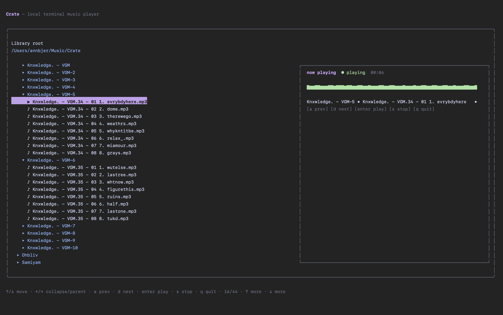

# Crate

Crate is a lightweight local-first terminal music player for macOS.

> Crate is currently an early macOS-focused prototype. It is usable, but intentionally minimal while the playback/backend strategy evolves.

## Preview



It is built for people who keep music in folders and want a calm keyboard-driven terminal player.

No accounts. No cloud library. No streaming service. No recommendations algorithm. No syncing drama.

Crate scans a local music folder, lets you browse by folders, and plays local files directly from the terminal.

## Current features

- Local folder browsing
- Folder-based artist / album / track navigation
- MP3/WAV playback with macOS `afplay`
- Previous/next visible track controls
- Auto-next after natural track completion
- Stop/quit cleanup for playback processes
- Playing-track indicator in the library tree
- Elapsed timer
- Scrolling now-playing title for long track names
- Accurate static waveform overview using optional local `ffmpeg`
- Local-only behavior
- No MPD, daemon, server, database, cloud APIs, or network behavior

## Requirements

- macOS
- Node.js / npm
- `afplay`, included with macOS
- Optional: `ffmpeg` for accurate waveform overview

Crate can still play music without `ffmpeg`; waveform generation will be unavailable if `ffmpeg` is missing.

## Install / run

```sh
git clone <repo-url>
cd crate
npm install
npm run typecheck
npm start
```

Run with a custom music library path:

```sh
npm start -- /path/to/music/library
```

Example:

```sh
npm start -- ~/Music/Crate
```

## Music library setup

Default library path:

```txt
~/Music/Crate
```

Expected folder structure:

```txt
~/Music/Crate/
  Artist/
    Album or Collection/
      01 Track.mp3
```

Crate derives artist/album/track information from folder and file names.

## Controls

```txt
↑ / ↓   move selection
← / →   collapse / expand folders
enter   play selected track
a       previous visible track
d       next visible track
s       stop playback
q       quit cleanly
ctrl+c  quit cleanly
```

## Current limitations

Crate currently uses macOS `afplay` to stay lightweight, local, and simple.

This is an intentional early design tradeoff. It keeps the app small and stable, but means some advanced media-player features are not implemented yet:

- true pause/resume
- seek `-30` / `+30`
- native media keys
- playback modes such as repeat/shuffle/random
- real-time spectrum visualization

Future versions may explore an optional `mpv` backend and separate real-time visualizer experiments.

## Terminal note

macOS Terminal.app works well for Crate’s live UI updates.

Ghostty may show subtle flicker when inactive during periodic live redraws, such as the elapsed timer or marquee title. This appears to be terminal-specific behavior and is documented for later investigation.

## Release checklist

Before tagging or sharing a release:

```txt
[ ] npm install
[ ] npm run typecheck
[ ] npm start
[ ] play track
[ ] stop track
[ ] previous/next
[ ] auto-next
[ ] quit cleanly
[ ] confirm no afplay / ffmpeg processes remain
[ ] test large folder viewport
[ ] test waveform with ffmpeg
[ ] test missing ffmpeg behavior later if possible
```

## Roadmap

Possible future work, without promises:

- Config/setup flow
- Pause/resume and seek research
- Optional `mpv` backend research
- Waveform cache by file path + mtime + size
- Real-time visualizer dev experiment
- Media key feasibility research
- Portable minimal Crate setup idea later, if it fits naturally

Crate should remain local-first, lightweight, and folder-friendly.
